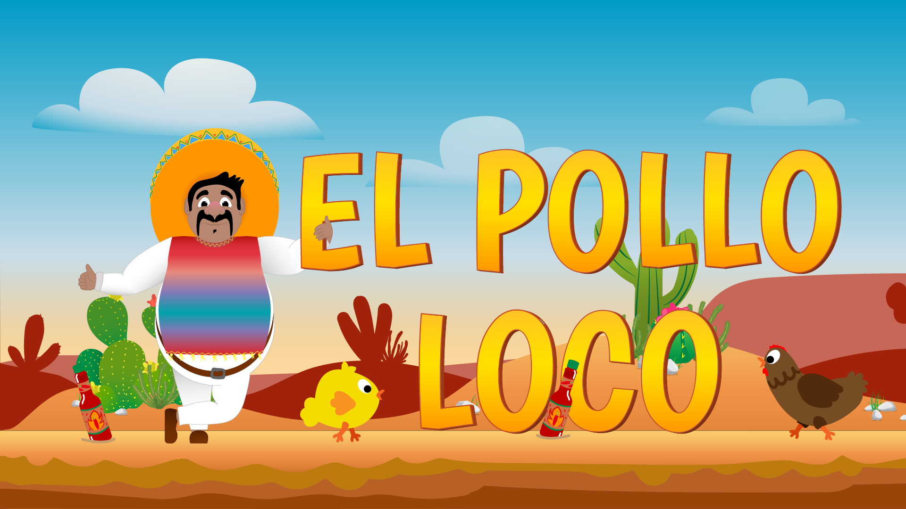

# 🐔 El Pollo Loco

Ein spannendes Jump-and-Run-Spiel im mexikanischen Stil, entwickelt mit purem JavaScript, HTML5 Canvas und CSS.



## 📖 Über das Spiel

El Pollo Loco ist ein klassisches 2D-Plattformspiel, in dem du **Pepe** steuerst, einen mutigen Charakter, der sich durch eine gefährliche Welt voller Hühner kämpft. Dein Ziel ist es, den Endboss zu besiegen, indem du Salsa-Flaschen auf ihn wirfst!

## 🎮 Spielfeatures

- **Flüssige Animationen**: Über 100 handgezeichnete Frames für realistische Charakterbewegungen
- **Gegner-System**: Normale Hühner, kleine Hühner und ein mächtiger Endboss
- **Sammelobjekte**: Münzen und Salsa-Flaschen zum Einsammeln
- **Wurfsystem**: Wirf Salsa-Flaschen auf deine Gegner
- **Statusanzeigen**: Gesundheit, Münzen und Flaschen werden angezeigt
- **Responsive Design**: Spielbar auf Desktop und mobilen Geräten
- **Mobile Controls**: Touch-Steuerung für Smartphones und Tablets
- **Audio-System**: Hintergrundmusik und Soundeffekte
- **Orientierungserkennung**: Automatische Pause bei Portrait-Modus auf Mobilgeräten

## 🕹️ Steuerung

### Desktop
- **Pfeiltasten ←/→**: Bewegen
- **Leertaste**: Springen
- **D**: Flasche werfen

### Mobile
- **Touch-Buttons**: Virtuelle Steuerung auf dem Bildschirm

## 🚀 Installation & Start

1. **Repository klonen**
   ```bash
   git clone https://github.com/DEIN-USERNAME/el-pollo-loco.git
   ```

2. **Projekt öffnen**
   ```bash
   cd el-pollo-loco
   ```

3. **Spiel starten**
   - Öffne die `index.html` Datei in einem modernen Webbrowser
   - Oder nutze einen lokalen Webserver:
     ```bash
     # Mit Python
     python -m http.server 8000
     
     # Mit Node.js (http-server)
     npx http-server
     ```

4. **Spielen!**
   - Öffne `http://localhost:8000` in deinem Browser

## 🛠️ Technologien

- **HTML5 Canvas** - Rendering und Grafik
- **Vanilla JavaScript** (OOP) - Spiellogik und Mechaniken
- **CSS3** - Styling und Responsive Design
- **Web Audio API** - Sound und Musik

## 📁 Projektstruktur

```
el-pollo-loco/
├── index.html              # Haupt-HTML-Datei
├── style.css              # Haupt-Stylesheet
├── audio/                 # Soundeffekte und Musik
├── img/                   # Alle Spielgrafiken
│   ├── 2_character_pepe/  # Charakter-Sprites
│   ├── 3_enemies_chicken/ # Gegner-Sprites
│   ├── 4_enemie_boss_chicken/ # Boss-Sprites
│   ├── 5_background/      # Hintergrund-Layer
│   ├── 6_salsa_bottle/    # Flaschen-Sprites
│   ├── 7_statusbars/      # UI-Elemente
│   └── 8_coin/            # Münzen
├── js/                    # JavaScript-Logik
│   ├── game.js            # Hauptspiel-Controller
│   ├── audio-manager.js   # Audio-Verwaltung
│   ├── ui.js              # UI-Management
│   └── mobile-controls.js # Touch-Steuerung
├── models/                # Spiel-Klassen (OOP)
│   ├── character.class.js # Spieler-Charakter
│   ├── chicken.class.js   # Hühner-Gegner
│   ├── endboss.class.js   # Boss-Gegner
│   ├── world.class.js     # Spielwelt
│   └── ...                # Weitere Klassen
├── levels/                # Level-Konfigurationen
│   └── level1.js          # Erstes Level
└── styles/                # Zusätzliche Stylesheets
    ├── game.css           # Spiel-Styles
    ├── mobile-controls.css # Mobile UI
    └── responsive.css     # Responsive Design
```

## 🎯 Spielziel

1. Sammle **Münzen** und **Salsa-Flaschen**
2. Besiege die **Hühner** durch darauf springen
3. Finde den **Endboss**
4. Wirf **Salsa-Flaschen** auf den Endboss, um ihn zu besiegen
5. Achte auf deine **Gesundheit** - weiche Gegnern aus oder eliminiere sie!

## 🎨 Objektoriertiertes Design

Das Spiel verwendet ein klares OOP-Konzept mit Vererbung:

- `DrawableObject` - Basisklasse für alle zeichenbaren Objekte
- `MoveableObject` - Erweitert DrawableObject mit Bewegung, Kollision und Gravitation
- `Character` - Der spielbare Charakter (Pepe)
- `Chicken` / `SmallChicken` / `Endboss` - Verschiedene Gegnertypen
- `ThrowableObject` - Werfbare Salsa-Flaschen
- `World` - Verwaltet die Spielwelt und Kollisionen
- `Level` - Level-Struktur mit Gegnern und Objekten

## 🌐 Browser-Kompatibilität

Das Spiel läuft in allen modernen Browsern:
- ✅ Chrome/Edge (empfohlen)
- ✅ Firefox
- ✅ Safari
- ✅ Opera

## 📱 Mobile Unterstützung

- Optimiert für Touch-Geräte
- Virtuelle Steuerungsbuttons
- Automatische Orientierungserkennung
- Responsive Canvas-Skalierung

## 🎓 Projekt-Kontext

Dieses Spiel wurde im Rahmen der **Developer Akademie** entwickelt und demonstriert:
- JavaScript OOP-Konzepte
- Canvas API und Animation
- Collision Detection
- Game Loop und Performance
- Responsive Web Design
- Audio-Integration

## 📝 Lizenz

Dieses Projekt wurde zu Bildungszwecken erstellt. Die Grafiken und Assets sind Teil des Kursmaterials der Developer Akademie.

## 👤 Autor

Entwickelt von **Daniel** im Rahmen der Developer Akademie Ausbildung.

---

**Viel Spaß beim Spielen! 🎮🐔**
